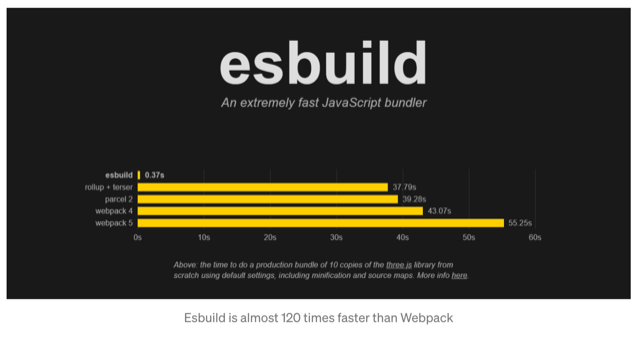

# Coding a Markdown Editor (with React)

First things first, if you want to run the app use `npm run dev` (for npm) or `yarn run dev` (if you are using yarn)!

## Why?

Of course there are already some good and [best Markdown editors](https://www.youtube.com/watch?v=GJGpBw4bWFk). But it is nice to "get in the mood" for bigger projects (Markdown Blog)! Also, you can always learn something along the way.

## How?

For now: Coding along to this nice [tutorial](https://www.youtube.com/watch?v=u6opJS10m5s&t=1037s) and writing down learnings. I really like the music-only-style of the tutorial 🎶💃 -> good inspiration for my own videos (in the future 😉)

Source code for this tutorial on [GitHub](https://bit.ly/3nR0TNC)

Maybe later: [this tutorial](https://www.youtube.com/watch?v=fF9vrZNSQC4) is a good repetition for React (useState, useContext, styled components)

## Learnings

### Use .js oder .jsx extension?

- **JSX** is the syntactic sugar on top of JS (using HTML in JS and transpile back to "real" JS with Babel)
- Airbnb argues, that JSX is not JS, and therefore should not go into .js files; .jsx files are more common and better practice
- others argue, that it is no longer needed since Babel showed up; it "hurts the eye", you can omit the .js extension while importing modules (e.g. `require('./MyComponent')` instead of `require('./MyComponent.js')` ) ect
- **At the end of the day both work and it seems to be a personal preference!**

### How to use Emmet in React

- in VScode, go to `settings > extensions > emmet > include languages` and add `javascript` as the item and `javascriptreact` as the value.

OR

- add this in settings.json: ` "emmet.includeLanguages": { "javascript": "javascriptreact", }`

### What is vite?

Vite is (among others) an alternative to create-react-app: [Official page](https://vitejs.dev/)

### CRA or Vite - which one is better?

[You Should Choose Vite Over CRA](https://medium.com/codex/you-should-choose-vite-over-cra-for-react-apps-heres-why-47e2e7381d13)

> For many beginners, intermediate and even for some expert programmers, Create React App is the key tool to start and maintain a React project because it provides many useful features such as Hot Module Replacement (HMR) and development server. However, it has a big drawback which is _poor performance_.
> ... When I tried to build something massive, like 25,000 lines of code, I started to get tired of waiting because when I started my project, the development server was getting ready in almost 5 minutes, and whenever I made a change in my code, I had to wait for almost 5 to 10 seconds to see the effects. _These times are pretty huge when you are working a real-life project._

- under the hood, CRA uses Webpack (a popular asset bundler that helps us develop & build a web app)

- "Webpack was fine until 2–3 years ago but today, we have almighty Esbuild."

- **Esbuild**: "It is a JavaScript build tool that is written in Go and thus, it is lightning fast."
  

- Many great features that CRA provides, Vite has too

## Differences

- **CRA**: _no configuration file_ for the build process. Ok for small projects. When the project gets bigger, the build process should be configured according to the needs of the project.
- **Vite**: provides a `vite.config.js` file that contains some additional configurations for projects. Simple & easy to configure
- The other difference between these two is the **build times** and **process**. While bundling the app for development, CRA rebundles the whole app whenever there is a change in the code. In contrast, Vite bundles whole app in the beginning and rebundles only the files those are changed. This makes building process faster.

## How to install Vite

It's easy! Type `npm create vite@latest` in the terminal. Then follow the prompt!

Or, check out the [Official page !](https://vitejs.dev/)
Also, mind the next chapter below -> "Downsides of Vite? Fixable!"

### Faster than CRA

"Apart from `npx` installation, the project is setup in 4 seconds. Afterwards I ran `npm install` to install dependencies. This took 15 seconds. So, all in all, the project is setup in almost 20 seconds."

"In CRA, after typing `npx create-react-app` apart from `npx` installation, it took almost 180 seconds which is pretty long time to just setup the project."

## Downsides of Vite? Fixable!

### ~~1. Importance of React in every JSX file~~

- ~~with CRA version 17, the importance of React is handled by CRA~~
- ~~... which means you don’t have to import React in every file~~
- ~~Unfortunately, in Vite, you still should import React in every JSX file~~

> Earlier, when the official react plugin was `@vitejs/plugin-react-refresh`, [this plugin](https://www.npmjs.com/package/vite-preset-react?activeTab=readme) would enable automatic JSX, so you wouldn't have import React in every file. Now with the new `@vitejs/plugin-react` providing the much better automatic JSX runtime, eliminating the need for `vite-preset-react` altogether, unless you need to remove react devtools.

> Amazing! The article was written on June 7th 2021. Now, more or less a year later it is already dated. (Also, how to install vite was dated.) -> It shows, how fast technologies are changing. **Also, I learned from this, that it is best to rely on the official documentation.**

### 2. Issue with SVG files

-> Issue 1 already being resolved, I'm not sure, if this issue still persists! 🤔
-> for up-to-date information check the official documentation of [vite-plugin-svgr](https://www.npmjs.com/package/vite-plugin-svgr)

- While using CRA, I was able to import SVG files as React component using `import {ReactComponent} as Pic from '../path'`.
- This is not the case for Vite

#### How to fix this!

- We should install one more plugin named `vite-plugin-svgr`
- Install it using `npm install --save-dev vite-plugin-svgr` command
- Then call it inside plugins array as follows:

- Now you can use the exact syntax to import SVGs as CRA.

... woah, woah, woah, what a rabbit-hole!!! But it was totally worth it. Already feel like a better developer knowing all this. My 1% getting better every day 😅 (14.06.2022, 3 hours after starting a 20 minutes tutorial ... )

### Installing vite

I learned, that I couldn't rely on the information in the Medium article, even though it was written a year before - not very old.

The main take-away here is, how fast technologies and even high-quality articles (like this one on Medium) can get dated. For best results, always stick to the [official documentation !](https://vitejs.dev/)

### react-markdown

[react-markdown](https://www.npmjs.com/package/react-markdown) is a React Component (npm package) to render Markdown.

> "This package focuses on making it easy for beginners to safely use markdown in React."

### ES7+ React/Redux/React-Native snippets

"Like Emmet, but for React"

### Building a Markdown Editor in a nutshell

1. scaffold your project with Vite
2. in App, create a MarkdownEditor component
3. Finally: create the [MarkdownEditor.jsx](../src/components/MarkdownEditor.jsx)
4. Style to your hearts desire

### Little adjustments I made

- For better responsiveness, I replaced px with em & vh / vw
- For better accessibility, I gave the output box a lighter grey and a border and changed colors for links
- To let the user know, what the project is about, I gave it a h1 and h2
- As mentioned, the plugin [vite-preset-react](https://www.npmjs.com/package/vite-preset-react?activeTab=readme) is no longer needed, as Vite already rapidly improved (see above, "Downsides of Vite? Fixable!")
- Running lighthouse in the chrome developer tools
- Added a `<meta name="description" content="...">` for 100% best practice
- for better accessibility, I added a label to the text-area -> and learned, you **cannot use** `for` **in React**, since "for" is a reserved word in JS; **use `htmlFor`** instead
- the performance is still pretty bad, but from what I understand, that would improve if I run `npm build`
  -> if you don't try, you never know -> check check -> yes, that's right - performance now at 100% 😅
- added some media queries for responsiveness
- I realized that the output box has a fixed height, which is not best practice -> if you put in a lot of Markdown, the text will overflow. -> so I just added a `overflow: scroll` to add a scroll bar and fix this problem
